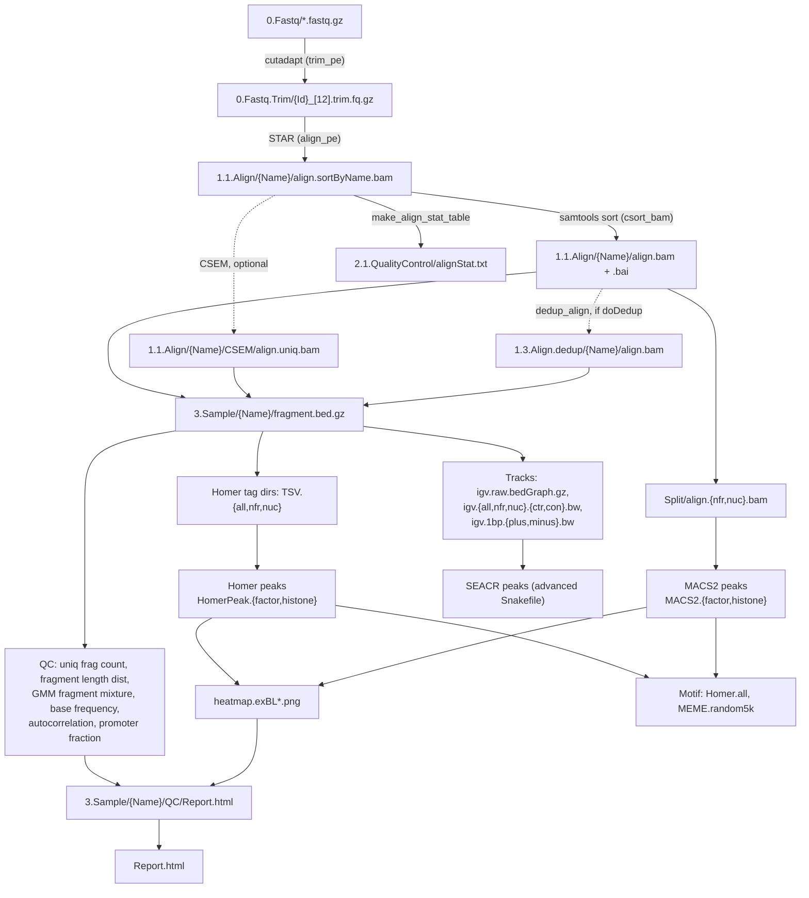

# Cutlery — Workflow Overview

Cutlery is a Snakemake pipeline for paired-end **CUT&RUN** data (also usable for **CUT&Tag** and
**ATAC-seq**) that runs on the CCHMC LSF cluster. It goes from raw FASTQ files to aligned BAMs,
fragment BED files, genome browser tracks, peak calls, motif enrichment, and a set of HTML QC
reports.

Repository root is referenced everywhere through the `$CUTLERY` environment variable; the pipeline
itself lives in `$CUTLERY/Snakemake`, and the tools it calls live in `$CUTLERY/Script` (exposed on
`$PATH` by the `Cutlery/1.0` environment module).

---

## 1. Repository layout

| Path | Contents |
|---|---|
| `Snakemake/Snakefile_Default` | **Default ("beginner") entry point.** Reads all parameters from `config.yml` and builds `rule all` from the requested output toggles. |
| `Snakemake/Snakefile` | **Advanced entry point.** Same rules, but parameters are hard-coded in the file itself and `rule all` is a fixed, fuller target list (adds SEACR, `base_freq_chrM`, MEME/Homer motifs for both peak callers). |
| `Snakemake/rules.pre.smk` | Trimming, STAR alignment, coordinate sorting, alignment stats, optional CSEM multimapper rescue. |
| `Snakemake/rules.post.smk` | Everything downstream of the BAM: fragments, QC, tracks, tag dirs, Homer/MACS2/SEACR peak calling, heatmaps, motifs, footprinting, reports. (~1800 lines, the bulk of the pipeline.) |
| `Snakemake/rules.average.smk` | Group-level bigWig averaging. **Not included by either Snakefile** and contains a syntax error — effectively dormant. |
| `Snakemake/validate.smk` | Sample-sheet and config validation, included by both Snakefiles before any rule is defined. |
| `Snakemake/config.yml` | User-facing configuration (default mode). |
| `Snakemake/cluster.yml` | Per-rule LSF resources (cpu / memory / walltime / job name / log paths). |
| `Snakemake/sample.tsv` | Sample sheet template. |
| `Script/` | All the actual work: `cnr.*` (Cutlery-specific) and a set of generic `ngs.*` helpers provided by the lab's shared modules. |
| `Resource/` | MEME motif DB in HOCOMOCO format, FreeSerif fonts (used to render "No peak detected" placeholder images). |
| `Plan/`, `Dev/`, `Dev.footprint/`, `obsolete/` | Design notes, in-development variants, retired code. |

---

## 2. Running the pipeline

Three driver scripts in `Script/` wrap the whole thing:

```
cnr.init.sh          # copy sample.tsv + config.yml into the work dir (default mode)
cnr.init.sh -a       # copy sample.tsv + Snakefile instead      (advanced mode)
cnr.dry_run.sh       # snakemake -np
cnr.submit_snake.sh  # render DAG to diag.pdf, then bsub the snakemake driver job
```

`cnr.dry_run.sh` and `cnr.submit_snake.sh` pick the mode by **testing whether `config.yml` exists
in the working directory**: if it does, they run `-s $CUTLERY/Snakemake/Snakefile_Default`;
otherwise they fall back to a local `Snakefile` (advanced mode).

Submission details: driver runs under `bsub -W 48:00 -q rhel9` with
`anaconda3` → `snakemake-7.18.2`, `-j 50`, `--rerun-incomplete`, `--latency-wait 60`, and a
`--cluster-config cluster.yml` template that submits each rule as its own `bsub` job. Logs land in
`logs/{rule}.{sample}.{out,err}`. Snakemake's cache is redirected to `/scratch/$USER/snakemake-cache`
via `XDG_CACHE_HOME`.

Every rule starts with `module purge` and loads exactly the modules it needs — `Cutlery/1.0`,
`STAR/2.7.4`, `cutadapt/2.1.0`, `R/4.4.0`, `samtools/1.14.0`, `bedtools`, `MACS/2.2.9.1`,
`Motif/1.0`, `MotifMEME/1.0`, `csem_limlab`, `ChIPseq/1.0`, `RNAseq/1.0`. Required environment
variables: `CUTLERY`, `COMMON_LIB_BASE`, `LIMLAB_BASE`, `TMPDIR`.

Cutlery is one repo in a family of lab pipelines that share `LimLabBase` (`commonBash.sh`,
`basicR.r`, `commonR.r`, `genomeR.r`, `motifR.r`, `genomeR.r`) and borrow tools from each other —
notably `ChIPexo-IDOM`, which supplies the footprint visualizer (§4.7).

---

## 3. Inputs

### `sample.tsv` (tab-delimited, `#` comments allowed)

| Column | Meaning |
|---|---|
| `Id` | Unique sample ID; keys the FASTQ/trimming stage. |
| `Name` | Unique human-readable name; keys every stage from alignment onward and names the output folder. |
| `Group` | Replicate group, used for pooled analysis and report grouping. |
| `Fq1`, `Fq2` | FASTQ file names inside `fastqDir`. `Fq2 = NULL` marks single-end. |
| `Ctrl` | `Name` of the IgG/input control for peak calling, or `NULL` for no control. |
| `PeakMode` | `factor` (narrow/TF), `histone` (broad), or `NULL` (no peak calling — e.g. the control samples themselves). |
| `PeakOpt` | Extra option string passed through to Homer `findPeaks`, e.g. `-FDR 0.0001`. |

`validate.smk` enforces: consistent column count on every line, all seven required columns present,
`Id`/`Name` unique, `Name`/`Group` restricted to alphanumeric + `_` + `.` (no dashes, because Homer
and downstream tools choke on them), other columns additionally allow `-`, and that
`chrom_size` / `star_index` / the sample sheet / `cluster.yml` all exist on disk.

### `config.yml`

Directory names, genome reference set (`genomeFa`, `chrom_size`, `peak_mask` blacklist, `genome`
name for Homer, `star_index`), STAR options, adapter (`NULL` disables trimming), cutadapt min
length/quality, `doDedup`, `chrRegexTarget`, optional `bed_promoter` for ATAC-style promoter
enrichment QC, per-caller `peak_calling` toggles, and `html_report` mode
(`replicate` / `pool` / `NULL`). Pre-canned reference blocks exist for **mm10, hg38, danRer11**;
`Snakefile_Default` maps these to MACS effective genome sizes (`mm`, `hs`, `1.4e9`).

---

## 4. Processing stages



### 4.1 Read preparation — `rules.pre.smk`

1. **`trim_pe`** — cutadapt on both mates with the configured adapter, `--minimum-length`,
   and quality trimming; writes to temp names then renames, so a killed job never leaves a
   half-written output. Skipped entirely when `adapter: NULL` (`doTrim = False`), in which case
   the raw FASTQs feed alignment directly.
2. **`align_pe`** — STAR in a CUT&RUN-appropriate configuration: splicing effectively disabled
   (`--alignSJDBoverhangMin 999 --alignIntronMax 1 --alignMatesGapMax 1000`), unique alignments only
   (`--outFilterMultimapNmax 1`), ≤5 % mismatches, `--alignEndsProtrude 2 ConcordantPair` to
   tolerate the short-fragment read-through typical of CUT&RUN. Output is name-sorted BAM.
3. **`csort_bam`** — coordinate sort + index.
4. **`make_align_stat_table`** — `star.getAlignStats.r` over all `align.*` log dirs →
   `2.1.QualityControl/alignStat.txt`.
5. **CSEM path (`run_csem` / `unify_csem`)** — optional multimapper reassignment, gated by a
   `do_csem` flag that defaults to `False` and is not currently exposed in `config.yml`.
6. **`dedup_align`** — optional (`doDedup`, default `False`; deduplication is explicitly *not*
   recommended for CUT&RUN, where duplicate fragments are often genuine).

`get_bam_for_downstream()` picks which BAM everything downstream consumes:
dedup → CSEM → plain alignment, in that precedence.

### 4.2 Fragments — the pipeline's central data structure

**`make_fragment`** converts the BAM to a coordinate-sorted `fragment.bed.gz` per sample, keeping
only concordant pairs (`-f 0x2`), dropping duplicates (`-F 0x400`), and filtering chromosomes by
regex. Almost every downstream rule reads this file rather than the BAM.

Fragments are then stratified by insert size, the key CUT&RUN/ATAC idiom:

- **NFR** (nucleosome-free / TF-bound): ≤ 119 bp
- **NUC** (nucleosome-associated): ≥ 151 bp
- **all**: unstratified

(The BAM-level split used for MACS2 uses a single 120 bp cut point instead of the 119/151 gap.)

Two representations are produced for each class: `con` = fragment kept at its original length,
`ctr` = fragment resized to a fixed 100 bp window around its center.

### 4.3 Quality control

| Output | Rule / tool | What it shows |
|---|---|---|
| `2.1.QualityControl/alignStat.txt` | `make_align_stat_table` | STAR mapping rates across all samples |
| `QC/fragment.uniq_cnt.txt` → `uniqFragCnt.{txt,pdf,png}` | `count_uniq_fragment`, `make_uniqcnt_table` | library complexity / duplication |
| `QC/fragLen.dist.{txt,png}` | `get_fragLenHist` | insert-size distribution (nucleosome laddering) |
| `QC/fragMix.txt` | `calc_frag_QC` → `cnr.calcFragMixture.py` | Gaussian-mixture decomposition of the length distribution into NFR/NUC weights |
| `QC/base_freq.{png,html}`, `base_freq_chrM.*` | `check_baseFreq*` | nucleotide bias at fragment 5′ ends (MNase/Tn5 cut preference); chrM version as a bias control |
| `QC/enrich.acor.{txt,png}` | `get_frag_autocor` | fragment autocorrelation / signal periodicity |
| `QC/promoter_portion.txt` → `promoterCnt.*` | `measure_promoter_fraction`, `make_promotercnt_table` | % fragments in TSS±1 kb — the ATAC-seq FRiP-style metric; only built when `bed_promoter` is set |
| `QC/spikeCnt.txt` → `spikein.txt` | `count_spikein`, `make_spikeintable` | spike-in normalization; rules exist but `spikePrefix` handling is incomplete (advanced Snakefile only) |
| `QC/kmer.freq.txt`, `kmer.scaleFactor.*` | `count_kmers`, `calc_kmer_scale` | developmental k-mer bias correction |

### 4.4 Genome browser tracks

- `igv.raw.bedGraph.gz` — raw fragment coverage; also the input SEACR requires.
- `igv.{all,nfr,nuc}.ctr.bw` — from 100 bp center-resized fragments.
- `igv.{all,nfr,nuc}.con.bw` — from full-length fragments.
- `igv.1bp.{plus,minus}.bw` — stranded 1 bp-resolution 5′-end cut sites (footprinting input).
- `igv.1bp.raw.abs.{plus,minus}.bw` — same, raw counts and non-negative on both strands
  (motivated by BPNet-style model input).
- `igv.all.splice.bw` — RNA-seq-style spliced coverage, added for a fly ATAC/SPS dataset.
- `igv.1bp.corrected{N}.{plus,minus}.bw` — k-mer bias-corrected version (developmental).

All bigWigs are RPM-normalized and chromosome-filtered by `chrRegexTarget`.

### 4.5 Peak calling

Three callers are wired in, each selecting fragment classes according to `PeakMode`:

**Homer** (`cnr.peakCallTF.sh` / `cnr.peakCallHistone.sh`, from Homer tag directories):
- `factor` mode uses the **NFR** tag dir, style `factor`, 200 bp peaks, then re-centers peaks on the
  NFR bigWig and emits `peak.exBL.1rpm.{bed,stat}` (blacklist-filtered, ≥1 RPM).
- `histone` mode uses the **NUC** tag dir, style `histone`, emits `peak.exBL.{bed,stat}`.
- Variants: `.allFrag` (all fragments instead of NFR/NUC) and `.noCtrl`.
- Control tag dir is supplied automatically from the `Ctrl` column, omitted when `Ctrl = NULL`.

**MACS2** (`-f BAMPE`, `--keep-dup all`):
- `factor` → NFR BAM, `--call-summits` → `macs_summits.exBL.bed`
- `histone` → NUC BAM, `--broad` → `macs_broad.exBL.bed`
- Variants: `.allFrag`, `.relax` (`-p 0.001`, for IDR), `.wo_ctrl`.
- Summits/peaks are blacklist-filtered, restricted to target chromosomes, and sorted by score.

**SEACR 1.3** — run from the raw bedGraphs, `norm` against the control bedGraph or
`0.01 non` when there is no control; produces `stringent` and `relaxed` peak sets, each with a
blacklist-filtered `.exBL.bed`. Only requested by the advanced `Snakefile`.

Which callers actually run in default mode is controlled by the `peak_calling` toggles in
`config.yml` (`homer.default`, `homer.all_fragments`, `macs.default`, `macs.all_fragments`).

### 4.6 Visualization and motifs

- **`draw_peak_heatmap_*`** — `cnr.drawPeakHeatmap.r` renders peak-anchored heatmaps over the
  sample's NFR and NUC bigWigs plus the control's, when a control exists (2 or 4 columns).
  Window is ±2 kb / 20 bp bins for factor peaks and ±10 kb / 20–100 bp bins for histone peaks.
  If the peak BED is empty, an ImageMagick-rendered "No peak detected" PNG is produced instead, so
  the DAG never breaks on a sample with zero peaks.
- **Homer motif** (`runHomerMotifSingle.sh`) — de novo + known motifs on ±100 bp around factor
  peaks, using the shared `homerPreparseDir` background.
- **MEME-ChIP** (`runMemeChipSingle.sh`) — 5,000 randomly sampled 200 bp peak regions against the
  merged MEME database.
- Both are run for Homer peaks and MACS2 peaks, and both short-circuit to an empty HTML when the
  input peak file has zero lines.

### 4.7 Footprinting (developmental) — Cutlery → IDOM

`analyze_footprint_homer` and `analyze_footprint_homer_corrected` drive
`cnr.analyzeFootprintBatch.r`, which is an orchestrator: it does motif selection, motif scanning,
and contrast filtering itself, then **shells out to `idom.visualizeExoBed.r` for the actual
footprint plots** — one subprocess per motif, run through `foreach`/`doParallel` at
`cluster["analyze_footprint_homer"]["cpu"]` = 4 threads.

**Pipeline inside `cnr.analyzeFootprintBatch.r`** (inputs: the factor peak BED + the Homer motif
results dir + `igv.1bp.{plus,minus}.bw`):

1. **Motif selection** — walk `homerResults/motif{1..maxMotifCount}.motif` (default 10), parse the
   native Homer header for best-guess name / score / p-value / target %, and keep motifs with
   `p ≤ 1e-10` and `target % ≥ minTargetPercent` (default 10). Concatenated into
   `<outPrefix>.0.selectedMotif.motif`. Genome defaults to whatever `motifFindingParameters.txt`
   in the Homer dir recorded, if `--genome` isn't given.
2. **Motif scan** — Homer `annotatePeaks.pl … -m … -mbed` over the peaks, keeping only motif loci
   → `<outPrefix>.1.motifScan.bed`.
3. **Footprint contrast filtering** — `getFootprintContrast()` extends each motif hit by a 20 bp
   margin, pulls stranded 1 bp signal from the bigWigs, and computes
   `log2((flank + 0.1) / (anchor + 0.1))`. Hits with `Contrast > 0` (i.e. protected in the motif,
   cut in the flanks — an actual footprint) survive into
   `<outPrefix>.2.<motif>.select.bed`. Motifs with zero survivors are silently dropped.
4. **Visualization** — for each surviving motif:
   ```
   idom.visualizeExoBed.r -o <outPrefix>.3.<motif>/CnR -g <genome> -t <motif> -f -s \
       <outPrefix>.2.<motif>.select.bed  <bwPrefix>
   ```
   producing `CnR.*.sorted.bed` / `.sorted.fa` / `.logo.{pdf,png}` / `.viz.png` /
   `.viz.avg.{pdf,png}` — DNA sequence panel, average profile, and a signal-sorted profile heatmap.
5. **`<outPrefix>.4.complete`** is touched only if every motif's visualization returned 0; that flag
   file is the rule's declared output.

**Cross-repo dependency.** `idom.visualizeExoBed.r` is **not part of Cutlery** — it lives in the
sibling `ChIPexo-IDOM` repo (`$HOME/bin/ChIPexo-IDOM/`), and is the ChIP-exo footprint
visualizer being reused for CUT&RUN, since both are 1 bp-resolution stranded cut-site data. It in
turn sources `$LIMLAB_BASE/IDOM/IDOM.r` and `$LIMLAB_BASE/ExoTools/ChipExoUtil.r`.
`Script/cnr.contrastFootprint.r` sources `IDOM.r` the same way. So the footprint branch needs, on
top of the usual Cutlery environment: `ChIPexo-IDOM` on `PATH`, and `IDOM/` + `ExoTools/` present
under `$LIMLAB_BASE`.

**Known breakage in this branch** (consistent with it not being in any `rule all`):

- Both `analyze_footprint_homer*` rules invoke `cnr.analyzeFootprintBatch.r … -g {genome}`, and
  `cnr.analyzeFootprintBatch.r` invokes `idom.visualizeExoBed.r … -g <genome>`. Neither script
  declares a `-g` short flag — both only define `--genome`. optparse rejects this outright with
  `error: short flag "g" is invalid`, so both calls fail immediately. Fix is `--genome` at both
  call sites (`rules.post.smk` and `cnr.analyzeFootprintBatch.r:281`).
- In the current checkout `$LIMLAB_BASE/IDOM/` and `$LIMLAB_BASE/ExoTools/` don't exist —
  `IDOM.r` is in `ChIPexo-IDOM/` and `ChipExoUtil.r` is in the `ChIPexo/` repo. The cluster modules
  may stage these differently, but on a plain checkout the `source()` calls won't resolve.
- `q(1)` on the failure path (line 313) passes `1` as R's `save` argument, not an exit status.

Related developmental material: `Dev.footprint/cnr.analyzeFootprint.r` (the pre-batch single-sample
version, which calls `idom.visualizeExoBed.r` with the same `-g` problem),
`Script/cnr.contrastFootprint.r`, and the MEME-based footprinting redesign sketched in
`Plan/README.md` and `Plan/[automatic_footprinting_naive]`.

### 4.8 Reports

- **`create_report_per_sample`** → `3.Sample/{Name}/QC/Report.html` — per-sample QC:
  alignment stats, unique fragment counts, base frequency, fragment length distribution and mixture
  model, peak heatmap, peak stats.
- **`create_final_report`** → `Report.html` — study-level summary across all samples.
- `*_pooled` variants of both build the `Report_pooled.html` family for group-pooled analysis.

Both are R scripts (`cnr.create*ReportHTML.r`) rendering the `.Rmd` templates in `Script/`
with plotly / kableExtra / cowplot / magick.

`html_report` in `config.yml` selects the mode: `replicate` (per-replicate reports plus
`alignStat.txt` and `uniqFragCnt`), `pool` (pooled reports; `fastqDir`/`trimDir` are set to `NULL`
because pooled runs start from existing fragment files), or `NULL` (no reports at all).

---

## 5. Output tree

```
<work dir>/
├── config.yml, sample.tsv, diag.pdf, submit.{out,err}
├── logs/                              # per-job LSF stdout/stderr
├── 0.Fastq/                           # inputs
├── 0.Fastq.Trim/                      # {Id}_[12].trim.fq.gz + trim log
├── 1.1.Align/{Name}/                  # align.bam(.bai), star.log, [CSEM/], [Split/]
├── 1.3.Align.dedup/{Name}/            # only when doDedup
├── 2.1.QualityControl/                # alignStat.txt, uniqFragCnt.*, promoterCnt.*, spikein.txt
├── 3.Sample/{Name}/
│   ├── fragment.bed.gz, fcl.bed.gz, Fragments/
│   ├── igv.*.bw, igv.raw.bedGraph.gz
│   ├── TSV.{all,nfr,nuc}/             # Homer tag directories
│   ├── HomerPeak.{factor,histone}[.allFrag|.noCtrl]/
│   │   ├── peak.exBL[.1rpm].{bed,stat}, heatmap.exBL*.png
│   │   └── Motif/{Homer.all,MEME.random5k}/
│   ├── MACS2.{factor,histone}[.allFrag|.relax|.wo_ctrl]/
│   ├── SEACR/                         # advanced mode
│   ├── Footprint.Homer.*/             # developmental
│   └── QC/                            # all per-sample QC + Report.html
└── Report.html
```

Two post-processing helpers reorganize this tree:
`cnr.exportResults.sh` regroups per-sample outputs into per-type folders
(`BigWig/`, `Peak/`, …) for sharing, and `cnr.create_fragment_links.sh` builds a new sample tree of
symlinks to existing `fragment.bed.gz` files so an alternative analysis can be re-run without
repeating alignment. `cnr.make_pool_tsv.sh` collapses a sample sheet to one row per `Group` for
pooled runs.

---

## 6. Design notes worth knowing

- **Fragment-centric, not BAM-centric.** After `make_fragment`, the BAM is only needed by the
  MACS2 branch, the chrM base-frequency check, and the spliced bigWig. Chromosome and flag filtering
  happen once, at BAM→fragment conversion (the old standalone `filter_align` rule is commented out).
- **`Id` vs `Name`.** Trimming is keyed on `Id`, everything after alignment on `Name`. This lets
  multiple FASTQ IDs be renamed into friendlier sample names without touching downstream paths.
- **Controls are optional throughout.** `get_ctrl_name()` returning `"NULL"` switches Homer, SEACR,
  and the heatmap bigWig list to no-control variants. MACS2 without a control exists as separate
  `.wo_ctrl` rules and is not wired into the default targets.
- **Empty peak files never break the DAG** — every motif and heatmap rule checks for zero lines
  first and emits a placeholder.
- **Two Snakefiles, one rule set.** `Snakefile_Default` and `Snakefile` differ only in how
  parameters are supplied and which targets are requested; both `include` the same
  `rules.pre.smk` / `rules.post.smk` / `validate.smk` from `$CUTLERY`.
- **Dormant / in-progress pieces:** `rules.average.smk` (not included, has a syntax error),
  spike-in normalization (`spikePrefix` documented as not yet implemented), k-mer bias correction,
  footprinting (broken `-g` flag + external IDOM dependency, see §4.7), and `do_csem`
  (defaults `False`, not exposed in `config.yml`).
- **Cutlery is not self-contained.** Beyond the `ngs.*` / `star.*` helpers from the shared modules,
  the footprint branch calls into the separate `ChIPexo-IDOM` repo. Anything touching footprinting
  has to be tested with that repo present.
